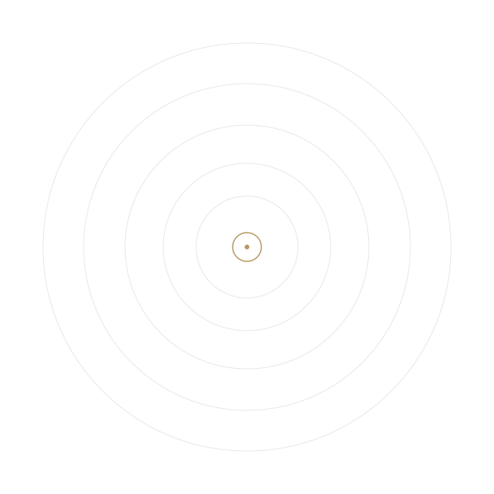

# Maha Gasim

Maha Gasim Omer Fdlalseed · Venice, Italy · <a href="mailto:mahagasim@gmail.com">mahagasim@gmail.com</a> · +39 379 216 3909 · <a href="https://www.linkedin.com/in/maha-gasim-678975122">LinkedIn</a> · <a href="https://github.com/mahagasim">GitHub</a>

I am a data analyst and applied researcher with a background in Mathematics and Computer Science and an MSc in Data Analytics for Business and Society from Ca’ Foscari University of Venice. My research interests lie at the intersection of applied microeconomics, health economics, ageing, family economics, and causal inference.

I currently hold a research grant at the Department of Economics, Ca’ Foscari University of Venice, where I work with SHARE data, causal-inference methods, and long-term-care policy analysis.

## Research Interests

<ul class="two-column-list">
  <li>Applied microeconomics</li>
  <li>Microeconometrics and causal inference</li>
  <li>Health economics</li>
  <li>Economics of ageing</li>
  <li>Family economics</li>
  <li>Economics of human capital</li>
</ul>

## Education

  <h3>MSc in Data Analytics for Business and Society</h3>
  
Ca’ Foscari University of Venice · Venice, Italy · 2024

  
Thesis: <em>The Health Consequences of Family Dissolution Late in Life: Evidence from SHARE.</em> 
  Supervisors: Danilo Cavapozzi and Giacomo Pasini.

  <h3>BSc (Honours) in Mathematics and Computer Science</h3>
  
University of Khartoum · Khartoum, Sudan · 2021

  
Thesis: <em>Predicting Students’ Final Grades Using Naive Bayes.</em> 
  Supervisor: Mohammed Khalid Hassan Mohammed.

## Advanced Training

  <h3>Inequalities in Health and Healthcare</h3>
  
Tinbergen Institute Summer School · Online · July 2026

  
Inequality and inequity measurement, decomposition, normative evaluation, distributional cost-effectiveness analysis, and equity-sensitive population-health measurement. Instructors: Owen O’Donnell and Tom Van Ourti.

  <h3>Causal Inference I</h3>
  
Mixtape Sessions · Online · September–October 2025

  
Design-based causal inference covering randomization inference, selection bias, matching, instrumental variables, and regression discontinuity. Instructor: Scott Cunningham, Baylor University.

  <h3>Panel Data for Causal Research Designs</h3>
  
Italian Econometric Association (SIdE) and FBK-IRVAPP · Bertinoro, Italy · June–July 2025

  
PhD-level training in fixed effects, difference-in-differences, staggered-treatment designs, and synthetic controls. Instructors: Erich Battistin, Enrico Rettore, Sergiu Burlacu, and Alessio Tomelleri.

  <h3>Google Data Analytics Professional Certificate</h3>
  
Google / Coursera · Online · May–August 2021

  
Eight-course certificate covering data cleaning, processing, visualization, R programming, spreadsheets, SQL, and analytical communication.

## Technical Skills

<ul class="skills-list">
  <li>Statistical tools: Stata, R, Python</li>
  <li>Data visualization: Microsoft Power BI, Google Looker, Qlik Sense</li>
  <li>Qualitative analysis: Dedoose</li>
</ul>

## Languages

<ul class="skills-list">
  <li>Arabic: Native</li>
  <li>English: C1</li>
  <li>Italian: A1</li>
</ul>

## Learning, encoded

  <figure>
    
  </figure>
  

    
I created this visual around a simple idea: learning is continuous. The expanding rings represent knowledge accumulating over time, while the binary reflects my background in mathematics and computer science.

    
<code>01001100</code> = L &nbsp; <code>01000101</code> = E &nbsp; <code>01000001</code> = A &nbsp; …

    
The complete ASCII sequence decodes to <strong>LEARNING IS A CONTINUOUS JOURNEY.</strong>

  

